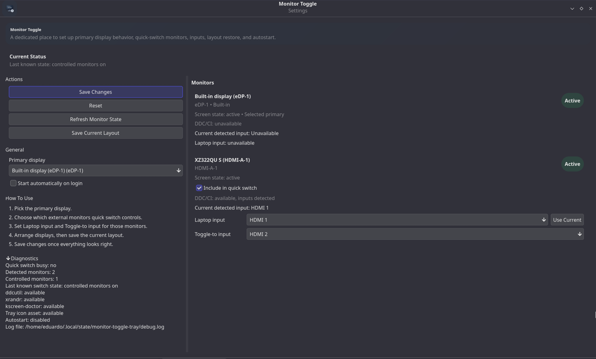

# Monitor Input & Layout Switcher

`monitor-toggle-tray` is a Linux tray app for laptops that share one or more external monitors with another device.

It combines two related jobs in one small tray utility:

- switch a monitor's active input with DDC/CI through `ddcutil`
- switch the laptop desktop layout with `xrandr` or `kscreen-doctor`

That makes it useful for setups like:

- one external monitor shared between a work laptop and a desktop PC
- a laptop dock setup where external displays should be disabled and restored quickly
- a KDE Plasma or Linux desktop where you want one click from the tray instead of manually changing monitor input and display layout every time

The project name, binary name, config directories, and desktop id remain `monitor-toggle-tray` for compatibility. The user-facing app name shown in the UI is now `Monitor Input & Layout Switcher`.

## Screenshot

Settings panel:



## What The App Does

When you trigger a quick switch, the app:

1. Detects the currently available monitors.
2. Finds the built-in or configured primary display.
3. Finds the external monitors marked for quick switching.
4. Decides whether it should turn those monitors off for the laptop or bring them back.
5. Changes each monitor input when DDC/CI input switching is available.
6. Disables or restores the matching desktop layout.

In practice, that means:

- if your selected external monitors are active, the app treats the action as "hand the displays to the other device"
- if those monitors are inactive, the app treats the action as "bring the displays back to the laptop"

## Features

- Tray icon with left click to run quick switch immediately
- Tray menu with `Quick switch now`, `Settings`, and `Quit`
- Dedicated settings window with a responsive split layout
- Pick the primary display used during quick switching
- Choose which external monitors are included in quick switch
- Store `Laptop input` and `Toggle-to input` for each supported monitor
- Capture the currently detected monitor input with `Use Current`
- Save the current display layout so external monitors return to the expected position and size
- Autostart support from inside the settings window
- Diagnostics section for backend availability and current app state
- Single-instance protection so only one tray instance runs at a time
- Background refresh of monitor state
- Debug log written under the XDG state directory

## Requirements

### Desktop environment

- Linux desktop session
- a tray / status notifier host in your desktop environment
- at least one connected display

### Tools

- Rust and Cargo for building from source
- `ddcutil` for monitor input detection and switching
- `xrandr` or `kscreen-doctor` for display layout changes

### Hardware

- for input switching, the monitor must support DDC/CI input control
- DDC/CI usually must be enabled in the monitor's on-screen menu
- depending on your distro and hardware, `ddcutil` may need the right permissions for I2C/DDC devices

## Supported Sessions

Display backend selection is automatic:

- on Wayland, the app prefers `kscreen-doctor` first and falls back to `xrandr`
- on X11, the app prefers `xrandr` first and falls back to `kscreen-doctor`

KDE Plasma is supported, including layout capture from `kwinoutputconfig.json` when available.

## Building From Source

From the project root:

```bash
cargo build
```

Useful development commands:

```bash
cargo check
cargo test
cargo run
```

The app uses a single-instance lock. If another instance is already running, a second launch exits instead of creating another tray icon.

## Running Without Installing

For local testing:

```bash
cargo run
```

This is useful while changing the code or testing monitor behavior before installing the app into your user profile.

## Installation

Install the app with:

```bash
./scripts/install.sh
```

The installer is user-local only. It does not write to `/usr`, `/usr/local`, or `/opt`.

### What The Installer Does

- builds a release binary with `cargo build --release`
- creates user-local XDG directories when needed
- stops a currently running instance before replacing the binary
- installs the binary to `~/.local/bin/monitor-toggle-tray`
- installs the icon to `~/.local/share/icons/hicolor/scalable/apps/monitor-toggle-tray.svg`
- installs the desktop launcher to `~/.local/share/applications/monitor-toggle-tray.desktop`
- refreshes the autostart desktop file if autostart was already enabled
- restarts the app if it had been running before install
- refreshes desktop and icon caches when helper tools are available

### Launching After Install

You can launch the app with:

```bash
monitor-toggle-tray
```

or:

```bash
~/.local/bin/monitor-toggle-tray
```

It is also available from the application launcher as:

```text
Monitor Input & Layout Switcher
```

## First-Time Setup

After the tray icon appears:

1. Open `Settings` from the tray menu.
2. Confirm the correct primary display.
3. For each external monitor you want to control, enable `Include in quick switch`.
4. Set `Laptop input` for each external monitor that supports DDC/CI input switching.
5. Set `Toggle-to input` for the input that belongs to the other device.
6. Arrange your displays the way you want them restored.
7. Click `Save Current Layout`.
8. Click `Save Changes`.

If the monitor is already on the correct laptop input, you can use `Use Current` to capture it.

## How To Use The App

### Tray usage

- left click the tray icon to run quick switch immediately
- right click or open the tray menu to access `Quick switch now`, `Settings`, and `Quit`

### Quick switch behavior

If any configured external monitor is active:

- the app disables the controlled external outputs in the laptop layout
- the app switches those monitors to their `Toggle-to input` when available

If none of the configured external monitors is active:

- the app switches those monitors back to their `Laptop input` when available
- the app restores the saved display layout

If a monitor does not expose DDC/CI input switching, the app still attempts the desktop layout change and reports the limitation in the result message.

### Settings window

The settings window includes:

- primary display selection
- autostart toggle
- one section per detected monitor
- quick-switch inclusion for external monitors
- `Laptop input` and `Toggle-to input` selectors where DDC/CI input switching is available
- `Use Current` for capturing the currently detected monitor input as the laptop input
- `Save Current Layout`
- `Refresh Monitor State`
- diagnostics for current app and backend state
- `Save Changes` and `Reset`

## Configuration And Stored Files

The app follows XDG directories.

Config file:

```text
${XDG_CONFIG_HOME:-~/.config}/monitor-toggle-tray/settings.toml
```

State directory:

```text
${XDG_STATE_HOME:-~/.local/state}/monitor-toggle-tray/
```

Debug log:

```text
${XDG_STATE_HOME:-~/.local/state}/monitor-toggle-tray/debug.log
```

Autostart entry:

```text
${XDG_CONFIG_HOME:-~/.config}/autostart/monitor-toggle-tray.desktop
```

The config stores:

- selected primary monitor id
- last known quick-switch state
- per-monitor quick-switch inclusion
- saved laptop and toggle-to input values
- saved monitor position and size for layout restore

On KDE Plasma, `Save Current Layout` can also read `kwinoutputconfig.json` to capture positions and sizes for the current active display set.

## Autostart

Autostart is controlled from the settings window and is disabled by default.

When enabled, the app writes a desktop entry to the XDG autostart directory that points to the installed executable path.

If you reinstall later with `./scripts/install.sh`, the installer refreshes that autostart file so it still points at the installed binary.

## Uninstall

Remove the app with:

```bash
./scripts/uninstall.sh
```

The uninstall script:

- stops a running instance if needed
- removes the binary, launcher, icon, autostart entry, config directory, and state directory from your user profile
- refreshes desktop and icon caches when helper tools are available

It does not remove:

- your Rust toolchain
- repository build artifacts under `target/`
- system packages such as `ddcutil`, `xrandr`, or `kscreen-doctor`

If you also want to remove build artifacts from the repository:

```bash
cargo clean
```

## Troubleshooting

If quick switch or monitor detection is not working:

- verify `ddcutil detect --brief` works on your machine
- verify `ddcutil getvcp 60 --brief` works for the target display
- verify DDC/CI is enabled in the monitor settings
- verify `xrandr --query` or `kscreen-doctor -o` works in the current session
- verify your desktop environment exposes a tray / status notifier host
- verify the external monitor is physically connected when restoring the laptop layout
- open `Settings` and check the diagnostics section
- inspect the debug log at `${XDG_STATE_HOME:-~/.local/state}/monitor-toggle-tray/debug.log`

If the tray app starts but input switching does nothing:

- the monitor may not support DDC/CI input switching
- the current user may not have permission to access DDC/I2C devices
- the monitor may expose incomplete DDC capability information

If the layout changes work but the monitor input does not:

- configure the app anyway and rely on layout switching only
- use `Use Current` to capture the detected laptop input when available

If you are on KDE Plasma and display restoration behaves unexpectedly:

- save the desired layout again with `Save Current Layout`
- confirm the intended displays are active before saving
- verify `kscreen-doctor -o` reports the outputs you expect

## Contributing

Issues and improvements are welcome.

If you are changing monitor behavior, it helps to include:

- your desktop session type (`X11` or `Wayland`)
- your desktop environment
- the output of `xrandr --query` or `kscreen-doctor -o`
- whether `ddcutil detect --brief` can see the monitor
- what you expected the quick switch to do
