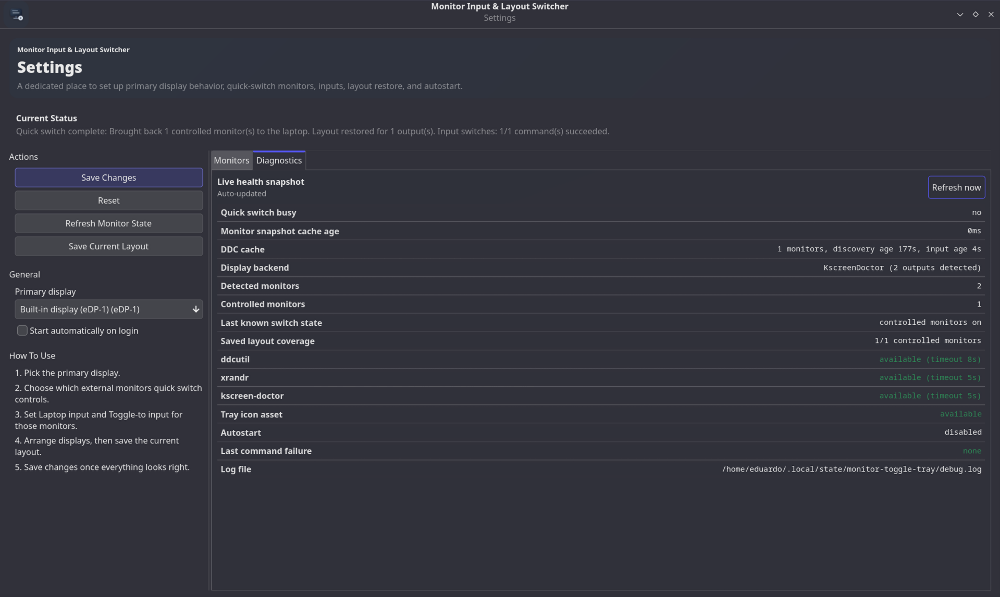

# Monitor Input & Layout Switcher

Monitor Input & Layout Switcher (`monitor-toggle-tray`) is a Linux tray app for quickly handing external monitors between your laptop and another device.

It combines two actions in one click:

- switch monitor inputs with DDC/CI (`ddcutil`) when available
- switch display layout with `kscreen-doctor` / `xrandr`

Project compatibility names are unchanged:

- binary: `monitor-toggle-tray`
- config/state directory: `monitor-toggle-tray`
- desktop ID: `monitor-toggle-tray`

## Screenshot



## Highlights

- Tray icon with left-click quick switch
- Tray menu: `Quick switch now`, `Settings`, `Quit`
- Dedicated settings window with monitor controls and diagnostics tab
- Per-monitor quick-switch include toggle
- Per-monitor `Laptop input` and `Toggle-to input` values
- `Use Current` helper for capturing current laptop input
- Save and restore monitor layout
- Autostart toggle from settings
- Single-instance protection
- Debug log file under XDG state directory

## How Quick Switch Works

When you trigger quick switch, the app detects your current state and chooses one of two directions:

1. Controlled monitors currently active -> switch away from laptop
2. Controlled monitors currently inactive -> restore to laptop

### Switch away from laptop

- Moves app windows from controlled external outputs to the primary output (KDE sessions)
- Disables controlled external outputs in the desktop layout
- Sends monitors to their configured `Toggle-to input` when DDC/CI switching is available

### Restore to laptop

- Sends monitors to their configured `Laptop input` when available
- Re-enables controlled outputs with saved layout positions/sizes
- Moves windows back from primary to a restored external output (KDE sessions)

If input switching is unavailable on a monitor, layout switching still runs.

## Requirements

### Required

- Linux desktop session with StatusNotifier/tray host
- Rust + Cargo (build from source)
- `xrandr` or `kscreen-doctor` (layout switching)

### Optional but recommended

- `ddcutil` (input detection/switching)

### Hardware notes

- DDC/CI must be supported and enabled per monitor for input switching
- Some systems require I2C/DDC permissions for non-root `ddcutil`

## Session And Desktop Notes

Display backend choice is automatic:

- Wayland: prefer `kscreen-doctor`, fallback `xrandr`
- X11: prefer `xrandr`, fallback `kscreen-doctor`

KDE Plasma has additional integration:

- window migration during quick switch via KWin scripting
- improved task-manager refresh behavior after output changes

The app does not intentionally rewrite your Task Manager behavior options (for example, `From the current screen`).

## Build And Run

From project root:

```bash
cargo build
```

Run locally:

```bash
cargo run
```

Useful dev checks:

```bash
cargo check
cargo test
cargo clippy --all-targets --all-features -- -D warnings
```

## Install

Install to your user profile:

```bash
./scripts/install.sh
```

Installed files:

- `~/.local/bin/monitor-toggle-tray`
- `~/.local/share/applications/monitor-toggle-tray.desktop`
- `~/.local/share/icons/hicolor/scalable/apps/monitor-toggle-tray.svg`

The installer is user-local only and does not write to system paths like `/usr`.

Launch after install:

```bash
monitor-toggle-tray
```

or

```bash
~/.local/bin/monitor-toggle-tray
```

## First-Time Setup

1. Open `Settings` from the tray menu.
2. Pick your primary display.
3. Enable `Include in quick switch` on the external monitors you want to control.
4. Set `Laptop input` and `Toggle-to input` where DDC is available.
5. Arrange displays as desired.
6. Click `Save Current Layout`.
7. Click `Save Changes`.

## Settings Overview

Main controls include:

- primary display selection
- autostart toggle
- monitor cards with input controls
- layout save/refresh actions

Diagnostics is available in its own tab and updates live.

## Configuration And Paths

Config file:

```text
${XDG_CONFIG_HOME:-~/.config}/monitor-toggle-tray/settings.toml
```

State directory:

```text
${XDG_STATE_HOME:-~/.local/state}/monitor-toggle-tray/
```

Debug log:

```text
${XDG_STATE_HOME:-~/.local/state}/monitor-toggle-tray/debug.log
```

Autostart entry:

```text
${XDG_CONFIG_HOME:-~/.config}/autostart/monitor-toggle-tray.desktop
```

## Uninstall

Remove app files from your user profile:

```bash
./scripts/uninstall.sh
```

Also remove config and state:

```bash
./scripts/uninstall.sh --purge
```

Optional cleanup of local build artifacts:

```bash
cargo clean
```

## Troubleshooting

If switching does not work as expected:

- check `ddcutil detect --brief`
- check `xrandr --query` and/or `kscreen-doctor -o`
- verify DDC/CI is enabled in monitor OSD
- verify the tray host is available in your desktop
- open Settings -> Diagnostics tab
- check the debug log path listed above

If the tray icon does not appear:

- make sure only one instance is running
- start from terminal to inspect immediate output/log updates

## Contributing

Issues and PRs are welcome.

Helpful details in bug reports:

- distro and desktop environment
- session type (`Wayland` or `X11`)
- output of `xrandr --query` or `kscreen-doctor -o`
- output of `ddcutil detect --brief`
- expected vs actual quick-switch behavior
